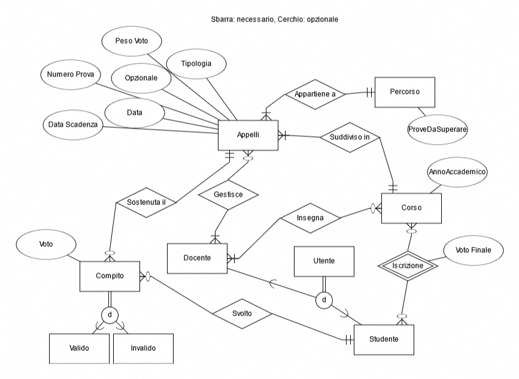
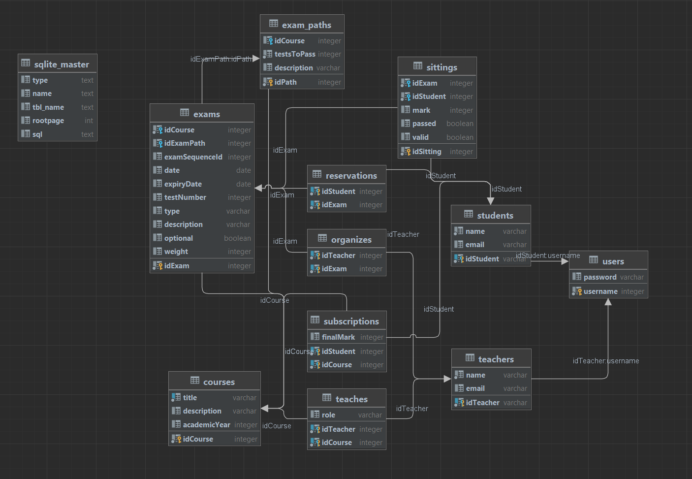

# Progetto Basi di dati 2023 - Spinello Ivan, Florian Sabani


# 1. Introduzione
Per la realizzazione di questo progetto, l’applicazione backend è stata sviluppata in Python con la libreria Flask, utilizzando SQLAlchemyCore come ORM per l’ interfacciamento con il DBMS sottostante SQLite. È stato scelto SQLite per la semplicita di utilizzo e portabilità, dato che tutto il database è contenuto in un singolo file. L'applicazione frontend invece è stata sviluppata in Javascript con il framework NextJS.
Le pagine HTML non vengono quindi renderizzate da Flask ma avviene una comunicazione tra back-end (flask) e front-end (angular) tramite il protocollo http in formato Json/REST. Perquanto riguarda il database e’ stato utiliz-zato DataGrip come ide per la visione e sim-ulazione delle query.
Le pagine HTML non vengono quindi renderizzate da Flask: il backend in Flask offre una API REST, che permette tramite il protocollo HTTP di ottenere i dati del database in formato JSON, facilmente manegiabile al lato frontend.

# 2. Architettura
Per la semplicita del progetto, abbiamo deciso di runnarlo esclusivamente il locale.
Il progetto è composto da un server backend, in ascolto delle richieste HTTP, ed il client frontend (il browser). È stato anche utilizzato Github per l'hosting del repository di sotware development e version control.

# 3. Installazione
### Backend
È necessario avere installato Python e il package manager pip.

#### Installazione
```bash
1. cd backend
2. pip install pipenv
```

#### Running su localhost:5000
```bash
1. cd backend
2. pipenv shell
3. flask --app src/main run
```

### Frontend
È necessario avere installato Node.js

#### Installazione
```bash
1. cd frontend
2. npm install
```

#### Building
```bash
1. cd frontend
2. npm run build
```

#### Running (development) su localhost:3000
```bash
1. cd frontend
2. npm run dev
```

# 5. Progetto
Il progetto si basa sulla realizzazione di un’applicazione web per la gestione degli esami universitari.
L'applicazione è riservata sia a studenti che a professori, e ha funzionalità diverse in base all'utenza. 
Gli studenti possono: 
- vedere le loro iscrizioni ai corsi di laurea, e iscriversi a nuovi
- vedere le loro iscrizioni agli appelli, e iscriviersi a nuovi
- vedere lo storico degli appelli svolti e delle prove attualmente valide
- poter accettare la verbalizzazione del voto finale

I professori possono:
- creare nuovi corsi
- creare nuovi appelli per i corsi
- vedere i corsi che gestiscono
- vedere gli appelli che gestiscono
- assegnare i voti alle prove degli studenti

La home permette agli utenti di fare il login. Il login viene salvato nel localstorage, e si puo fare logout in qualsiasi momento.

# 6. Progettazione del DB
É necessario progettare una base di dati adeguata per fornire un sistema di gestione dei dati. Per implementare una base di dati, per prima cosa si analizza la realtà che si vuole andare a descrivere, trasformandola in un modello. Si identificano di seguito le entità che fanno parte di questa realtà e si relazionano tra loro.




Il codice fornito rappresenta la definizione di un database utilizzando il framework Flask-SQLAlchemy in Python. Il design del database segue uno schema relazionale con tabelle che rappresentano entità e relazioni tra di loro.


Importazione dei moduli: Il codice inizia importando il modulo "flask_sqlalchemy" per utilizzare SQLAlchemy insieme a Flask. SQLAlchemy è un toolkit ORM (Object-Relational Mapping) che semplifica l'interazione con il database relazionale attraverso oggetti Python.

Inizializzazione del database: Viene creata un'istanza di SQLAlchemy chiamata "db", che sarà utilizzata per definire i modelli delle tabelle e gestire le operazioni di database.

Classe astratta SerializableModel: Viene definita una classe astratta chiamata "SerializableModel", che estende il modello di SQLAlchemy "db.Model". L'attributo "abstract" viene impostato su "True" per indicare che questa classe non deve essere utilizzata per creare una tabella nel database. La classe fornisce un metodo "to_dict" che restituisce un dizionario rappresentante gli attributi dell'oggetto.

Tabella "Users": Viene definita una tabella chiamata "Users" che rappresenta gli utenti del sistema. Ha due colonne: "password" di tipo "db.String" e "username" di tipo "db.Integer". La colonna "username" viene dichiarata come chiave primaria.

Tabelle "Students" e "Teachers": Vengono definite due tabelle separate per gli studenti e gli insegnanti. Entrambe le tabelle hanno una colonna "idStudent" e "idTeacher" rispettivamente, che fanno riferimento alla colonna "username" della tabella "Users" come chiavi esterne. Le tabelle hanno anche altre colonne come "name" (nome dell'utente), "email" (indirizzo email dell'utente) e vengono dichiarate come non nullable.

Tabella "Courses": Viene definita una tabella chiamata "Courses" per rappresentare i corsi. La tabella ha una colonna "idCourse" come chiave primaria, una colonna "title" (titolo del corso) dichiarata come unica (valori univoci), una colonna "description" (descrizione del corso) e una colonna "academicYear" (anno accademico).

Tabelle "Subscriptions" e "Teaches": Vengono definite due tabelle di associazione per rappresentare le relazioni di iscrizione degli studenti ai corsi e gli insegnanti che insegnano i corsi. Entrambe le tabelle hanno colonne "idStudent" e "idCourse" che fanno riferimento alle rispettive tabelle come chiavi esterne. La tabella "Subscriptions" ha anche una colonna "finalMark" per rappresentare il voto finale ottenuto dallo studente nel corso. La tabella "Teaches" ha una colonna "role" per indicare il ruolo dell'insegnante nel corso.

Tabella "ExamPaths": Viene definita una tabella chiamata "ExamPaths" per rappresentare i percorsi degli esami. La tabella ha una colonna "idPath" come chiave primaria, una colonna "idCourse" che fa riferimento alla tabella "Courses" come chiave esterna, una colonna "testsToPass" per indicare il numero di test da superare nel percorso e una colonna "description" per la descrizione del percorso.

Tabella "Exams": Viene definita una tabella chiamata "Exams" per rappresentare gli esami. La tabella ha una colonna "idExam" come chiave primaria, una colonna "idCourse" che fa riferimento alla tabella "Courses" come chiave esterna, una colonna "idExamPath" che fa riferimento alla tabella "ExamPaths" come chiave esterna, e altre colonne come "examSequenceId" (identificatore della sequenza dell'esame), "date" (data dell'esame), "expiryDate" (data di scadenza dell'esame), "testNumber" (numero di test), "type" (tipo di esame), "description" (descrizione dell'esame), "optional" (opzionale o obbligatorio) e "weight" (peso dell'esame).

Tabella "Organizes": Viene definita una tabella di associazione chiamata "Organizes" per rappresentare la relazione tra gli insegnanti e gli esami che organizzano. La tabella ha colonne "idTeacher" e "idExam" che fanno riferimento alle rispettive tabelle come chiavi esterne.

Tabella "Reservations": Viene definita una tabella di associazione chiamata "Reservations" per rappresentare la relazione tra gli studenti e gli esami a cui si sono prenotati. La tabella ha colonne "idStudent" e "idExam" che fanno riferimento alle rispettive tabelle come chiavi esterne.

Tabella "Sittings": Viene definita una tabella chiamata "Sittings" per rappresentare i compiti degli studenti in un esame. La tabella ha una colonna "idSitting" come chiave primaria, una colonna "idExam" che fa riferimento alla tabella "Exams" come chiave esterna, una colonna "idStudent" che fa riferimento alla tabella "Students" come chiave esterna, e altre colonne come "mark" (voto ottenuto), "passed" (superato o non superato), "valid" (valido o non valido). Viene utilizzata anche una "CheckConstraint" per limitare il valore della colonna "mark" tra 0 e 100.

Queste sono le principali scelte progettuali riguardanti il database modellato nel codice fornito. Il design mira a rappresentare le entità coinvolte nel sistema, le relazioni tra di loro e le proprietà specifiche di ciascuna entità.

# 7. Query Principali
Le query vengono eseguite nel backend tramite l'ORM, e i dati vengono forniti tramite le rotte HTTP dell'API REST. 
Di seguito viene fornita una spiegazione dettagliata di ciascuna query:


## 7.1 Studenti
```python
python

from ..utils import *
from ..models import *
from flask import Blueprint, request
from sqlalchemy import func
from .courses import getCourses

bp = Blueprint('students', __name__, url_prefix='/students')
```

In queste righe iniziali vengono importati moduli e librerie necessari per il funzionamento del codice. Vengono importati i moduli utils e models dall'ambito superiore, il modulo Blueprint e request dal pacchetto flask, e func dal modulo sqlalchemy. Viene inoltre importata la funzione getCourses dal modulo courses dell'applicazione corrente. Viene creato un oggetto Blueprint denominato 'students' con il prefisso URL /students.

python

```python
@bp.get("/")
def getStudents():
  res = db.session.query(Students)
  return simpleQueryToList(res)
```

Questa è una route che gestisce una richiesta GET all'URL /students/. Quando viene effettuata una richiesta a questo endpoint, la funzione getStudents() viene chiamata. La funzione esegue una query sul database per recuperare tutti gli oggetti Students e restituisce i risultati chiamando la funzione simpleQueryToList().

```python
@bp.get("/<int:student>/")
def getStudentData(student):
  res = db.session.query(Students).filter_by(idStudent=student).one()
  return res.to_dict
```

Questa route gestisce una richiesta GET all'URL /students/<int:student>/. Il parametro <int:student> indica che l'URL deve includere un numero intero che sarà assegnato alla variabile student. La funzione getStudentData() viene chiamata quando viene effettuata una richiesta a questo endpoint. La funzione esegue una query sul database per recuperare un singolo oggetto Students con l'id corrispondente al valore di student e restituisce il risultato chiamando il metodo to_dict() sull'oggetto restituito dalla query.

```python
@bp.get("/<int:student>/subscribed/")
def getSubscribedCourses(student):
  res = db.session.execute(
    db.select(Courses)
    .join(Subscriptions)
    .where(Subscriptions.idStudent == student)
  ).all()

  return complexQueryToList(res)
```

Questa route gestisce una richiesta GET all'URL /students/<int:student>/subscribed/. La funzione getSubscribedCourses() viene chiamata quando viene effettuata una richiesta a questo endpoint. La funzione esegue una query complessa sul database per recuperare tutti i corsi a cui lo studente con l'id corrispondente a student è iscritto. La query unisce le tabelle Courses e Subscriptions e applica una clausola where per filtrare le iscrizioni dello studente corrente. I risultati della query vengono restituiti chiamando la funzione complexQueryToList().

```python
@bp.get("/<int:student>/courses/")
def getNotSubscribedCourses(student):
  courses = getCourses()
  subscribed = getSubscribedCourses(student)
  return [item for item in courses if item not in subscribed]
```

Questa route gestisce una richiesta GET all'URL /students/<int:student>/courses/. La funzione getNotSubscribedCourses() viene chiamata quando viene effettuata una richiesta a questo endpoint. La funzione richiama la funzione getCourses() per ottenere tutti i corsi disponibili. Successivamente, richiama la funzione getSubscribedCourses(student) per ottenere i corsi a cui lo studente è iscritto. Infine, viene restituita una lista che contiene solo i corsi non presenti nella lista subscribed.

```python
@bp.post("/<int:student>/subscribe")
def subscribeFromCourse(student):
  req = request.get_json()

  subscription = Subscriptions(idStudent=student, idCourse=req['idCourse'])

  db.session.add(subscription)
  db.session.commit()
  return {"status": "success"}
```

Questa route gestisce una richiesta POST all'URL /students/<int:student>/subscribe. La funzione subscribeFromCourse() viene chiamata quando viene effettuata una richiesta a questo endpoint. La funzione recupera i dati inviati nella richiesta JSON utilizzando il modulo request di Flask. Viene creato un nuovo oggetto Subscriptions con l'id dello studente corrente e l'id del corso ottenuti dai dati della richiesta. L'oggetto subscription viene quindi aggiunto alla sessione del database e viene eseguito un commit per salvare i cambiamenti nel database. Infine, viene restituito un dizionario che indica lo stato dell'operazione.

Le altre route seguono un approccio simile, gestendo le richieste GET o POST a determinati URL e interagendo con il database utilizzando SQLAlchemy per eseguire le query e modifiche necessarie. Le funzioni effettuano operazioni come recupero di dati, iscrizione a corsi, annullamento dell'iscrizione, prenotazione di esami, visualizzazione dei risultati degli esami, ecc.

## 7.2 Docenti
Di seguito sono fornite le spiegazioni dettagliate delle query per la documentazione del progetto:

```python
from ..utils import *
from ..models import *
from flask import Blueprint, request

bp = Blueprint('teachers', __name__, url_prefix='/teachers')
```

In queste righe iniziali vengono importati moduli e librerie necessari per il funzionamento del codice. Vengono importati i moduli utils e models dall'ambito superiore e il modulo Blueprint e request dal pacchetto flask. Viene creato un oggetto Blueprint denominato 'teachers' con il prefisso URL /teachers.

```python
@bp.get("/")
def getTeachers():
  res = db.session.query(Teachers)
  return simpleQueryToList(res)
```

Questa è una route che gestisce una richiesta GET all'URL /teachers/. Quando viene effettuata una richiesta a questo endpoint, la funzione getTeachers() viene chiamata. La funzione esegue una query sul database per recuperare tutti gli oggetti Teachers e restituisce i risultati chiamando la funzione simpleQueryToList().

```python
@bp.get("/<int:teacher>/")
def getTeacherData(teacher):
  res = db.session.query(Teachers).filter_by(idTeacher=teacher).one()
  return res.to_dict
```

Questa route gestisce una richiesta GET all'URL /teachers/<int:teacher>/. Il parametro <int:teacher> indica che l'URL deve includere un numero intero che sarà assegnato alla variabile teacher. La funzione getTeacherData() viene chiamata quando viene effettuata una richiesta a questo endpoint. La funzione esegue una query sul database per recuperare un singolo oggetto Teachers con l'id corrispondente al valore di teacher e restituisce il risultato chiamando il metodo to_dict() sull'oggetto restituito dalla query.

```python
@bp.get("/<int:teacher>/courses")
def getTeachedCourses(teacher):
  res = db.session.execute(
      db.select(Courses)
      .join(Teaches)
      .where(Teaches.idTeacher == teacher)
  ).all()

  return complexQueryToList(res)
```

Questa route gestisce una richiesta GET all'URL /teachers/<int:teacher>/courses. La funzione getTeachedCourses() viene chiamata quando viene effettuata una richiesta a questo endpoint. La funzione esegue una query complessa sul database per recuperare tutti i corsi insegnati dal docente con l'id corrispondente a teacher. La query unisce le tabelle Courses e Teaches e applica una clausola where per filtrare i corsi insegnati dal docente corrente. I risultati della query vengono restituiti chiamando la funzione complexQueryToList().

```python
@bp.get("/<int:teacher>/exams")
def getCoursesExams(teacher):
  res = db.session.execute(
      db.select(Exams)
      .join(Courses)
      .join(Teaches)
      .where(Teaches.idTeacher == teacher)
  ).all()

  return complexQueryToList(res)
```

Questa route gestisce una richiesta GET all'URL /teachers/<int:teacher>/exams. La funzione getCoursesExams() viene chiamata quando viene effettuata una richiesta a questo endpoint. La funzione esegue una query complessa sul database per recuperare tutti gli esami associati ai corsi insegnati dal docente con l'id corrispondente a teacher. La query unisce le tabelle Exams, Courses e Teaches e applica una clausola where per filtrare gli esami associati ai corsi insegnati dal docente corrente. I risultati della query vengono restituiti chiamando la funzione complexQueryToList().

```python
@bp.get("/<int:teacher>/sittings")
def getSittings(teacher):
  res = db.session.execute(
      db.select(Sittings)
      .join(Exams)
      .join(Courses)
      .join(Teaches)
      .where(Teaches.idTeacher == teacher)
  ).all()

  return complexQueryToList(res)
```

Questa route gestisce una richiesta GET all'URL /teachers/<int:teacher>/sittings. La funzione getSittings() viene chiamata quando viene effettuata una richiesta a questo endpoint. La funzione esegue una query complessa sul database per recuperare tutte le sedute di esame associate ai corsi insegnati dal docente con l'id corrispondente a teacher. La query unisce le tabelle Sittings, Exams, Courses e Teaches e applica una clausola where per filtrare le sedute di esame associate ai corsi insegnati dal docente corrente. I risultati della query vengono restituiti chiamando la funzione complexQueryToList().

```python
@bp.get("/<int:teacher>/exams/<int:exam>/students")
def getCoursesExamStudents(teacher, exam):
  res = db.session.execute(
    db.select(Students)
      .join(Sittings)
      .join(Exams)
      .join(Courses)
      .join(Teaches)
      .where(Teaches.idTeacher == teacher, Exams.idExam == exam)
  ).all()

  return complexQueryToList(res)
```

Questa route gestisce una richiesta GET all'URL /teachers/<int:teacher>/exams/<int:exam>/students. I parametri <int:teacher> e <int:exam> indicano che l'URL deve includere due numeri interi che saranno assegnati alle variabili teacher e exam. La funzione getCoursesExamStudents() viene chiamata quando viene effettuata una richiesta a questo endpoint. La funzione esegue una query complessa sul database per recuperare tutti gli studenti che hanno partecipato a una specifica seduta di esame (exam) associata a un corso insegnato dal docente (teacher). La query unisce le tabelle Students, Sittings, Exams, Courses e Teaches e applica clausole where per filtrare gli studenti, le sedute di esame, i corsi e i docenti corrispondenti. I risultati della query vengono restituiti chiamando la funzione complexQueryToList().

```python
@bp.post("/<int:teacher>/createCourse/")
def createCourse(teacher):
  req = request.get_json()
  newCourse = Courses(
      title=req['title']
  )
  db.session.add(newCourse)
  db.session.commit()

  relation = Teaches(
    idCourse=newCourse.idCourse,
    idTeacher=teacher
  )

  db.session.add(relation)
  db.session.commit()

  return {"status": "success"}
```

Questa route gestisce una richiesta POST all'URL /teachers/<int:teacher>/createCourse/. La funzione createCourse() viene chiamata quando viene effettuata una richiesta a questo endpoint. La funzione ottiene i dati inviati nella richiesta tramite request.get_json(). Viene creato un nuovo oggetto Course con il titolo fornito nella richiesta e viene aggiunto al database. Viene creata una relazione Teaches tra il nuovo corso e il docente specificato da teacher e la relazione viene anche aggiunta al database. Infine, viene restituito un messaggio di conferma di successo.

```python
@bp.post("/<int:teacher>/createExam/")
def createExam(teacher):
  req = request.get_json()
  newExam = Exams(
      idCourse=req['idCourse'],
  )
  db.session.add(newExam)
  db.session.commit()

  relation = Organizes(
      idExam=newExam.idExam,
      idTeacher=teacher
  )
  db.session.add(relation)
  db.session.commit()

  return {"status": "success"}
```

Questa route gestisce una richiesta POST all'URL /teachers/<int:teacher>/createExam/. La funzione createExam() viene chiamata quando viene effettuata una richiesta a questo endpoint. La funzione ottiene i dati inviati nella richiesta tramite request.get_json(). Viene creato un nuovo oggetto Exam con l'id del corso fornito nella richiesta e viene aggiunto al database. Viene creata una relazione Organizes tra il nuovo esame e il docente specificato da teacher e la relazione viene anche aggiunta al database. Infine, viene restituito un messaggio di conferma di successo.

```python
@bp.post("/<int:teacher>/assignMark")
def assignMark(teacher):
  req = request.get_json()
  sitting = (
    Sittings.query
      .join(Exams)
      .join(Courses)
      .join(Teaches)
      .where(Teaches.idTeacher == teacher, Sittings.idSitting==req['idSitting'])
  ).one()

  sitting.mark = req['mark']
  db.session.commit()

  return {"status": "success"}
```

Questa route gestisce una richiesta POST all'URL /teachers/<int:teacher>/assignMark. La funzione assignMark() viene chiamata quando viene effettuata una richiesta a questo endpoint. La funzione ottiene i dati inviati nella richiesta tramite request.get_json(). Viene eseguita una query per recuperare la seduta di esame corrispondente all'id specificato nella richiesta (idSitting) e associata al docente specificato da teacher. Viene quindi aggiornato il valore mark della seduta di esame con il valore fornito nella richiesta e viene effettuato il commit delle modifiche nel database. Infine, viene restituito un messaggio di conferma di successo.

## 7.3 Login
Questa porzione di codice gestisce una richiesta di login.

```python
from ..utils import *
from ..models import *
from flask import Blueprint, request
from .students import getStudentData
from .teachers import getTeacherData

bp = Blueprint('login', __name__)

@bp.post('/login')
def login():
  req = request.get_json()
  print(req)

  if req['type'] == 'STUDENT':
    userToLogin = db.one_or_404(
        db.select(Users)
          .join(Students)
          .where(Users.username==req['username'])
    )
    return getStudentData(userToLogin.username)
  
  elif req['type'] == 'TEACHER':
    userToLogin = db.one_or_404(
        db.select(Users)
          .join(Teachers)
          .where(Users.username==req['username'])
    )
    return getTeacherData(userToLogin.username)
```

La funzione login() viene chiamata quando viene effettuata una richiesta POST all'URL '/login'. La funzione inizia ottenendo i dati inviati nella richiesta tramite request.get_json(). Successivamente, viene verificato il tipo di utente richiesto ('STUDENT' o 'TEACHER') attraverso il valore di req['type'].

Se il tipo di utente è 'STUDENT', viene eseguita una query sul database per cercare un record nella tabella Users che abbia lo stesso username fornito nella richiesta. La query utilizza il metodo join() per unire la tabella Users con la tabella Students e applica una clausola where per confrontare gli username. Se la query non restituisce risultati, viene restituito un errore 404. Se viene trovato un record corrispondente, viene chiamata la funzione getStudentData() del modulo students passando l'username dell'utente trovato come argomento. La funzione getStudentData() restituirà i dati dello studente corrispondenti all'username.

Se il tipo di utente è 'TEACHER', viene eseguita una query sul database in modo simile al caso dello studente, ma questa volta la tabella Teachers viene utilizzata nel metodo join(). Viene eseguita una ricerca nella tabella Users per un record con lo stesso username fornito nella richiesta. Se la query non restituisce risultati, viene restituito un errore 404. Se viene trovato un record corrispondente, viene chiamata la funzione getTeacherData() del modulo teachers passando l'username dell'utente trovato come argomento. La funzione getTeacherData() restituirà i dati del docente corrispondenti all'username.

In entrambi i casi, i dati restituiti dalla funzione getStudentData() o getTeacherData() saranno il risultato della chiamata di login.


# 8. Scelte progettuali
Sono necessarie delle scelte progettuali utili per poter delineare al meglio tutte le modalità per implementare nella maniera più efficiente e pulita tutto il codice. Per questo motivo ab- biamo deciso di implementare dei vincoli, trig- ger, check su attributi, transazioni utili per le prenotazioni e ruoli nella base di dati per ge- stire le autorizzazioni degli utenti.

## 8.1 Triggers
Questo trigger per il database viene chiamato "same_exam" e viene attivato dopo l'inserimento di una riga nella tabella "Sittings". Viene eseguito per ogni riga inserita nella tabella "Sittings".

Il trigger è definito con la seguente struttura:

CREATE TRIGGER same_exam
AFTER INSERT ON Sittings
FOR EACH ROW

La clausola "AFTER INSERT ON Sittings" specifica che il trigger sarà attivato dopo l'inserimento di una riga nella tabella "Sittings". "FOR EACH ROW" indica che il trigger viene eseguito per ogni riga inserita.

La parte successiva del trigger definisce una condizione "WHEN". La condizione verifica se esistono delle righe nella tabella "Sittings" che soddisfano determinate condizioni, utilizzando una sottoquery.

La sottoquery SELECT viene utilizzata per selezionare tutte le righe dalla tabella "Sittings" con alias "s1" e "s2" tali che s1.idSitting sia diverso da s2.idSitting. Le tabelle "Exams" vengono collegate utilizzando i rispettivi idSitting. Vengono effettuati ulteriori controlli tramite le clausole WHERE.

La condizione di confronto nella clausola WHERE verifica se e1.idExamPath è uguale a e2.idExamPath e se e1.examSequenceId è uguale a e2.examSequenceId.

Se la condizione WHEN del trigger viene soddisfatta, viene eseguito il blocco di istruzioni definito all'interno del blocco BEGIN...END.

All'interno del blocco BEGIN...END, viene eseguita un'istruzione di aggiornamento (UPDATE). La tabella "Sittings" viene aggiornata impostando il valore del campo "valid" su FALSE per le righe che soddisfano la condizione specificata.

La condizione specificata nella clausola WHERE del blocco di aggiornamento verifica se l'idSitting è presente nella sottoquery SELECT.

La sottoquery SELECT viene utilizzata per selezionare l'idSitting dalla tabella "Sittings" in cui viene eseguito un join con la tabella "Exams" utilizzando l'idExam. Viene effettuato un controllo aggiuntivo per verificare se l'idStudent è uguale a new.idStudent (il valore appena inserito) e se l'idExam è diverso da new.idExam.

Viene utilizzata una sottoquery SELECT aggiuntiva per selezionare l'idExamPath dalla tabella "Exams" in base all'idExam appena inserito (new.idExam).

In sintesi, questo trigger ha lo scopo di aggiornare il campo "valid" nella tabella "Sittings" impostando il valore su FALSE per le righe che condividono lo stesso idExamPath e examSequenceId, ad eccezione della riga appena inserita.

## 8.2 SQL Injections
La maggior parte delle query sono state costruite con i metodi appartenenti alla libreria SQLAlchemy, che sanitizza in automatico i parametri che gli passiamo!

# 9. Frontend
Il frontend dell'applicazione è stato sviluppato utilizzando il framework Next.js in JavaScript. Next.js è un framework React che permette di creare applicazioni web con rendering lato server (Server-side Rendering) e generazione statica (Static Site Generation).

Il frontend comunica con il backend attraverso richieste HTTP, seguendo il protocollo JSON/REST. L'applicazione utilizza il formato JSON per lo scambio dei dati tra frontend e backend, consentendo una facile manipolazione dei dati nel frontend.

La struttura del frontend è organizzata in componenti React, che rappresentano le diverse parti dell'interfaccia utente. Questi componenti sono sviluppati in JavaScript utilizzando JSX, una sintassi che combina HTML e JavaScript.

Il frontend offre le seguenti funzionalità:

Pagina di login: consente agli utenti di autenticarsi nel sistema inserendo le proprie credenziali. I dati di accesso vengono inviati al backend per la verifica.

Pagina principale: dopo aver effettuato il login, gli utenti vengono indirizzati alla pagina principale. Questa pagina mostra le diverse sezioni dell'applicazione, come l'elenco dei corsi, gli appelli, lo storico degli esami, ecc.

Iscrizione ai corsi: gli studenti possono visualizzare l'elenco dei corsi disponibili e iscriversi a quelli desiderati. Questa funzionalità consente agli studenti di gestire la propria pianificazione accademica.

Iscrizione agli appelli: gli studenti possono visualizzare l'elenco degli appelli disponibili per i corsi a cui sono iscritti e iscriversi agli appelli desiderati. Questa funzionalità consente agli studenti di pianificare le proprie date di esame.

Visualizzazione dello storico degli esami: gli studenti possono visualizzare lo storico degli esami svolti, inclusi i voti ottenuti e lo stato di superamento. Questa funzionalità fornisce agli studenti un riepilogo delle loro prestazioni accademiche.

Accettazione della verbalizzazione: gli studenti possono accettare la verbalizzazione del voto finale. Questa funzionalità consente agli studenti di confermare il risultato del loro esame.

Creazione di nuovi corsi (per i professori): i professori possono creare nuovi corsi nel sistema. Questa funzionalità consente ai professori di gestire l'offerta accademica.

Creazione di nuovi appelli (per i professori): i professori possono creare nuovi appelli per i corsi che gestiscono. Questa funzionalità consente ai professori di pianificare gli esami per i loro corsi.

Assegnazione dei voti (per i professori): i professori possono assegnare i voti alle prove degli studenti. Questa funzionalità consente ai professori di valutare le prestazioni degli studenti.

React è un framework JavaScript ampiamente utilizzato per lo sviluppo di interfacce utente (UI) interattive e reattive. È stato creato da Facebook e ha guadagnato una grande popolarità grazie alla sua efficienza e alla facilità di utilizzo. Il suo approccio dichiarativo alla creazione delle UI rende il codice più facile da comprendere e mantenere.

Ecco una panoramica dettagliata dei concetti chiave all'interno del framework React:

    Componenti: React si basa sul concetto di componenti riutilizzabili. Un componente rappresenta una parte isolata dell'interfaccia utente, che può avere il proprio stato (state) e comportamento. I componenti possono essere composti insieme per creare interfacce complesse.

    JSX: JSX (JavaScript XML) è un'estensione della sintassi di JavaScript utilizzata in React per definire la struttura delle UI. Con JSX, è possibile scrivere codice che assomiglia a un mix di HTML e JavaScript, consentendo di definire la struttura dell'interfaccia utente all'interno del codice JavaScript.

    Virtual DOM: React utilizza un'astrazione chiamata Virtual DOM per migliorare le prestazioni delle applicazioni. Il Virtual DOM è una rappresentazione leggera e virtuale del DOM reale. Ogni volta che lo stato di un componente cambia, React aggiorna il Virtual DOM e lo confronta con la versione precedente per determinare quali parti dell'interfaccia utente devono essere effettivamente aggiornate nel DOM reale. Questo approccio riduce al minimo le manipolazioni dirette del DOM, rendendo l'applicazione più efficiente.

    Ciclo di vita del componente: I componenti React seguono un ciclo di vita ben definito, che comprende diversi metodi che vengono chiamati in momenti specifici del ciclo di vita. Ad esempio, il metodo componentDidMount viene chiamato subito dopo che un componente viene inserito nel DOM, mentre componentWillUnmount viene chiamato prima che il componente venga rimosso dal DOM. Questi metodi consentono di eseguire azioni specifiche in determinati momenti del ciclo di vita di un componente.

    State e Props: Lo stato (state) e le proprietà (props) sono due concetti fondamentali in React. Lo stato rappresenta i dati che possono cambiare all'interno di un componente e influenzare la sua rappresentazione nell'interfaccia utente. Le proprietà, invece, sono dati passati da un componente genitore a un componente figlio. Il cambio di stato o di props può causare un aggiornamento dell'interfaccia utente corrispondente.

    Gestione degli eventi: React consente di gestire gli eventi utente, come i clic del mouse o le pressioni di tasti, in modo dichiarativo. È possibile associare gli eventi a specifici elementi dell'interfaccia utente e definire funzioni di callback che vengono eseguite quando si verifica l'evento.

    Riutilizzo dei componenti: Grazie al concetto di componenti, React promuove il riutilizzo del codice. I componenti possono essere creati una volta e utilizzati in diverse parti dell'applicazione. Ciò rende più facile mantenere e aggiornare l'interfaccia utente in modo coerente.

    Routing: Anche se React in sé non offre funzionalità di routing, è spesso utilizzato insieme a librerie come React Router per implementare la navigazione tra diverse pagine o viste all'interno di un'applicazione React.

Questi sono solo alcuni dei principali concetti all'interno del framework React. React offre anche molte altre funzionalità, come la gestione degli stati globali con Redux o MobX, il testing, la rendering server-side (Next.js), e molto altro. È un ecosistema molto vasto e attivo, con una comunità di sviluppatori dedicati che contribuiscono a un'ampia gamma di librerie e strumenti per semplificare lo sviluppo di applicazioni React.